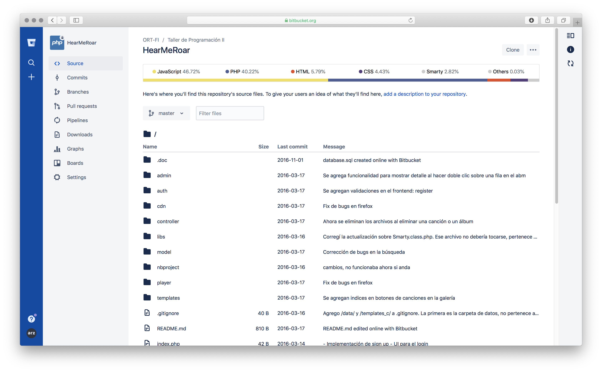

# Bitbucket Linguist

Bitbucket add-on that brings GitHub language bar to your Bitbucket repo overview.

  

## Setting up dev environment

1. [Install Atlassian SDK](https://developer.atlassian.com/server/framework/atlassian-sdk/install-the-atlassian-sdk-on-a-linux-or-mac-system/)
2. `npm install`

## Installing the add-on

1. Log into your Bitbucket instance as admin.
2. Click the user dropdown and choose **Integrations**.
3. Click **Manage integrations** option in Integrations and Features section.
4. Click **Install add-on from URL**.
5. Enter this URL: `https://github-code-stats-4-bitbucket.herokuapp.com` and then click **Intall** button.
6. **Grant access** to the requested permissions (read for repositories and read for repositories contained within your team's projects)
7. You're all set! <small>Enjoy this amazing add-on!</small>

## License

[MIT](LICENSE.txt)
